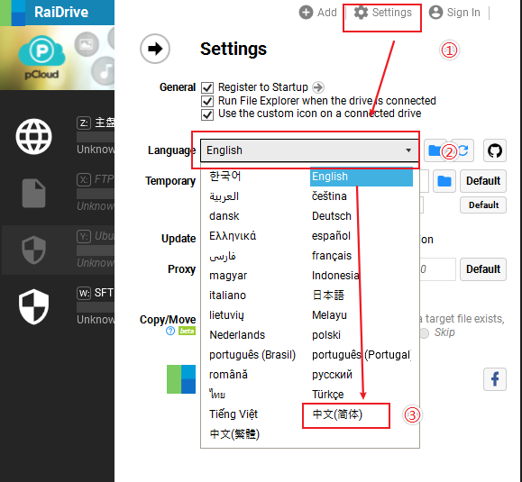
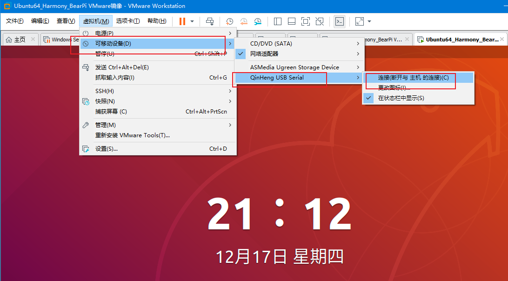
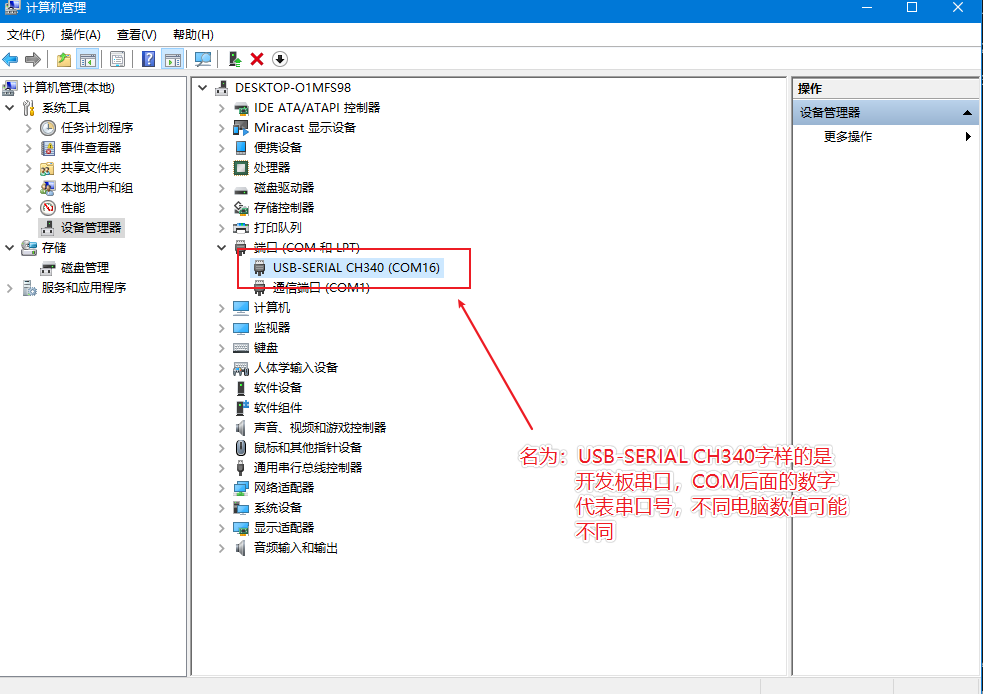
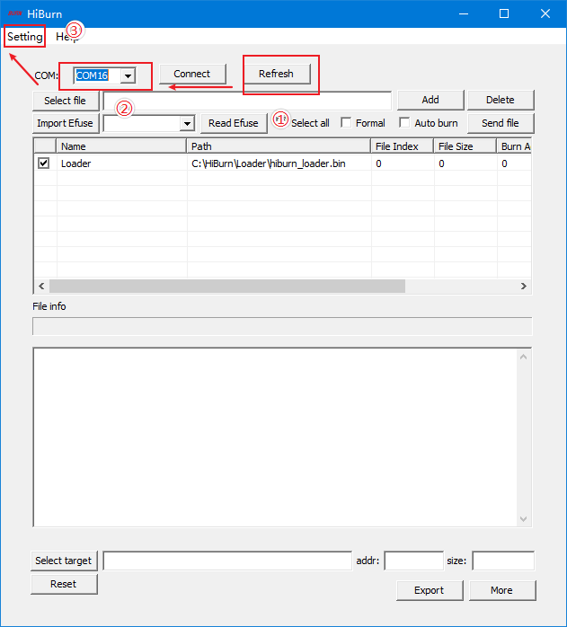
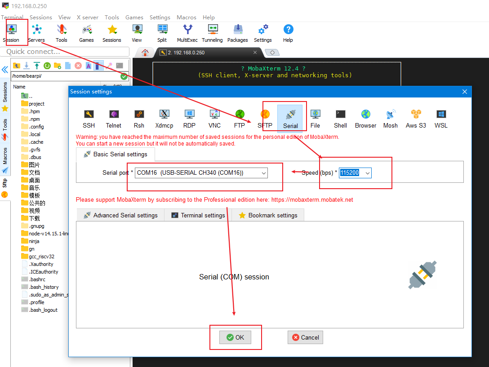

开发板名称：BearPi-HM Nano


开发板描述：BearPi-HM Nano开发板，面向开发者，用于OpenHarmony开发学习，同时提供丰富案例和教程，通过NFC实现碰一碰联网及拉起服务

描述：OpenHarmony开发板 BearPi-HM Nano 碰一碰联网


发行版: @bearpi/bearpi_hm_nano

版本:  1.0.1  

发布时间: 2020-12-03 16:39:06

MCU/处理器：Hi3861RNIV100


# 开发板介绍

## 开发板概述

BearPi-HM Nano是一块专门为OpenHarmony设计的开发板，板载高度集成的2.4GHz WLAN SoC芯片Hi3861，并板载NFC电路及标准的E53接口，标准的E53接口可扩展智能加湿器、智能台灯、智能安防、智能烟感等案例


## 开发板功能

BearPi-HM Nano开发板，面向开发者，用于OpenHarmony开发学习，同时提供丰富案例和教程，实现全场景应用设计

1. E53 Interface：是一种资源丰富，易于扩展的标准接口，实现多应用案例扩展，使得案例开发变得更加灵活和方便

2. NFC：板载的NFC射频电路，配合OpenHarmony开放的关键能力，可以完美实现OpenHarmony系统的“碰一碰”联网机制和服务拉起功能，降低用户操作复杂度，从而提高用户体验

3. 用户按键：开放式功能按键，按键功能全权由开发者定义，增加了用户可操作性


## 开发板详情


## 应用案例场景

### 开发板应用场景

BearPi-HM Nano可用于智能加湿器、智能台灯、智能安防、智能烟感等案例。

1. 智能加湿器：可实时监测室内当前的温湿度，可实现远程实时的开启和关闭加湿器

2. 智能台灯:可实时监测当前的室内光照强度，低于预定的阈值时，自动开启台灯，并可实现对台灯的单独控制

3. 智能安防：可实时监测范围内人体的移动，并上报云端显示，实现智能安防的监测和警报

4. 智能烟感：可实时监测当前房间中的烟雾浓度，并上报云端显示，当烟雾浓度超过设定的阈值时，报警器立即触发警报

### 上手指南


一、准备工作<a name="section466851916410"></a>
- 准备一台电脑：
    - 无具体要求，家用即可，Windows系统

二、开始下载
- 下载官方提供镜像
    - 下载地址（百度云）：https://pan.baidu.com/s/1T0Tcl3y48C1p5L6y-6HJNg  提取码：eusr
- 下载HiBurn
    - 下载地址（百度云）：https://pan.baidu.com/s/1i6P_LuUzclS6hlQ3XHOobQ&t=downloads 提取码：1234

- 下载并安装虚拟机VMware Workstation
    - 下载地址：https://www.vmware.com/products/workstation-player/workstation-player-evaluation.html

- 下载并安装MobaXterm工具
    - 下载地址：https://en.softonic.com/download/moba/windows/post-download

- 下载并安装RaiDrive工具
    - 下载地址：https://forspeed.rbread05.cn/down/newdown/5/28/RaiDrive.rar   
- 下载并安装开发板USB驱动
    - 下载地址：http://www.wch.cn/search?q=ch340g&t=downloads
- 下载并安装VS Code
    - 下载地址：https://code.visualstudio.com
三、开始部署环境

1. 解压百度云下载的OpenHarmony`Ubuntu18.4镜像OVF.zip`文件到某个目录。

    

2. 打开VMware Workstation工具

    

3. 选择第1步解压的`Ubuntu18.4镜像OVF`文件夹中，点击` 打开 `

    

4. 导入镜像到本地磁盘（选择一个磁盘空间大小≥ 10G的盘），点击`导入`。

    

5. 点击`开启此虚拟机`，来开启虚拟机电源
 
    
    
6. 此时虚拟机进入登录界面，点击`HarmonyOS`

    

7. 输入密码：bearpi，然后点击`登录`

    

8. 进入桌面后，点击桌面空白处`右键`，点击`打开终端(E)`

    

9. 在终端中输入`ifconfig`，然后点击回车，除`lo`外，另外一个就是你的网卡信息，记录你获取到的IP地址。

    

10. 最小化VMware Workstation，回到Windows桌面上。

11. 附加：如果连不上网络（如果主机网络需要拨号，如`校园网络`、`ADSL拨号`等）

    在VMware Workstation中，点击`虚拟机`>> `设置`

    

    然后在网络适配器中，改成`NET 模式`，点击`确定`

    

    然后再回复`步骤8`。
    

四、在Windows上远程连接服务器

1. 打开`MobaXterm`工具，并依次点击：`Session`，`SSH` 按钮。

    

2. 输入连接信息，远程地址，并点击OK

    

3. 输入账号：`bearpi`，点击回车

    

4. 输入密码：`bearpi`，注意，输入密码的时候屏幕不会显示，输完之后点击`回车`

    

5. 在弹出的界面上，点击`Yes`保存账号信息，以免下次输入

    

五、把ubuntu文件远程映射到Windows上

1. 安装RaiDrive软件
    
    默认安装即可。

2. 切换为中文语言

    

3. 添加链接信息

    * SFTP://______ （这个输入 三.9 获取到的地址）
    * 账户：账号和密码皆为 bearpi   
    * 其他默认
    * 点击`确定`

    

4. 查看本地映射的ubuntu文件路径

    


六、在ubuntu获取源码

1. 鼠标焦点移到MobaXterm

2. 在MobaXterm中输入：
    ```
    cd /home/bearpi
    ```
    然后回车

3. 在MobaXterm中输入： 
    ```
    mkdir project && cd project
    ```
    然后回车

4. 在MobaXterm中输入：
    ```
    hpm init -t default
    ```
    然后回车

5.  在MobaXterm中输入：

    ```
    hpm i @bearpi/bearpi_hm_nano
    ```
    然后回车，等待1-3分钟（根据不同网速）

6. 当屏幕中出现`Installed.`意味着代码获取完成


七、编译代码

1. 在MobaXterm中输入：
    ```
    hpm dist
    ```
    然后回车，等待直到屏幕出现：`BUILD SUCCESS`字样，说明编译成功。

2. 查看编译出的固件位置

    当编译完后，在Windows中可以直接查看到最终编译的固件，具体路径在：

    

    *注意，最前的磁盘在为`RaiDrive`映射的路径。

八、连接开发板

1. 通过TypeC数据线，把电脑与BearPi-HM Nano连接。

2. 安装CH340驱动。

    下载地址：http://www.wch.cn/search?q=ch340g&t=downloads

3. 关闭虚拟机捕获USB功能。（有很多开发者都是因为虚拟机捕获了USB设备，导致本机Windows电脑看不到串口）

    

    如果上面操作不行，直接关闭VMware Workstation，选择挂起，然后再重新插拔USB。

4. 查看开发板的串口

    

九、下载程序

1. 在Windows打开Hiburn工具，并点击`Refresh`，在`COM`中选择`第八-4`看到的COM号

    

    然后点击`Setting`，并选择 `Com settings`，

2. 在Com settings中设置`Baud`为：`921600`，点击确定    

    

3. 点击 Hiburn工具中的`Select file`按钮，在弹出的文件框中，选择`七-2` 中对应的路径，并选中：`Hi3861_wifiiot_app_allinone.bin` 文件。

    

4. 点击`Auto burn`复选框，然后点击`Connect`

    

    此时`Connect`按钮变成`Disconnect`，等待下载

5. 复位开发板`RESET`按键，开始下载程序

    

    

    
6. 直到出现`Execution Successful`字样，程序下载完成。

7. 下载完后，点击`Disconnect`按钮，便于后面调测使用。


十、MobaXterm 查看串口打印日志

1. 打开MobaXterm，
    
    1. 点击：`Session`、`Serial`按钮

    2. 设置Seral port为 Hiburn 同一个串口

    3. 设置Speed为 `115200`

    4. 点击`OK`


    

2.  如果显示Unable to open...等字样，需要看一下Hiburn的链接状态是否为关闭（九-7）步骤。


3. 复位开发板，此时COM打印出对应日志信息

    

### 代码样例说明

BearPi-HM Nano提供多个案例，案例以A、B、C、D进行不同类别进行分级，方便初学者由浅入深逐步学习。您拿到工程后经过简单的编程和下载即可看到实验现象。下面依次对A/B/C/D类进行介绍：

* `A1 - A99`：内核类
* `B1 - B99`：基础外设类
* `C1 - C99`：E53传感器类
* `D1 - D99`：物联网类

例程列表如下所示：

| 编号 | 类别   | 例程名           | 说明                                                         |
| ---- | ------ | ---------------- | ------------------------------------------------------------ |
| A1   | 内核   | thread           |   任务交替打印  |
| A2   | 内核   | timer            |  定时器 |
| A3   | 内核   | event            |   事件|
| A4   | 内核   | mutex            |   互斥锁|
| A5   | 内核   | semp             |   信号量|
| A6   | 内核   | message           |    消息队列|
| B1   | 基础   | led_blink        |  红色 LED 不间断烁|
| B2   | 基础   | button           |   按键控制LED灯亮灭|
| B3   | 基础   | pwm_led          |   红色 LED 呼吸灯|
| B4   | 基础   | adc_mq2          |   ADC读取电压|
| B5   | 基础   | i2c_bh1750       |   I2C读取NFC标签|
| B6   | 基础   | basic_uart       |   UART自发自收|
| C1   | E53传感器   | e53_sf1_example        |       驱动烟雾传感器 MQ2|
| C2   | E53传感器   | e53_ia1_example              |   驱动温湿度传感器 SHT30|
| C3   | E53传感器   | e53_sc1_example             |   驱动光强传感器 BH1750|
| C4   | E53传感器   | e53_sc2_example        |   驱动 6 轴陀螺仪 MPU6050|
| C5   | E53传感器   | e53_is1_example              |   驱动人体红外传感器|
| D1   | 物联网 | iot_wifi_ap        |   Wifi热点创建|
| D2   | 物联网 | iot_wifi_sta_connect    |   Wifi联网|
| D3   | 物联网 | udp_client       |   使用 Socket 实现 UDP 客户端|
| D4   | 物联网 | tcp_server       |   使用 Socket 实现 TCP 服务端|
| D5   | 物联网 | iot_mqtt             |   使用 Paho-MQTT 软件包实现 MQTT 协议通信|
| D6   | 物联网 | iot_cloud_oc_sample     |  接入华为IoT 云平台|
| D7   | 物联网 | iot_cloud_onenet_sample         |   接入中国移动 OneNET 云平台|  
||||


