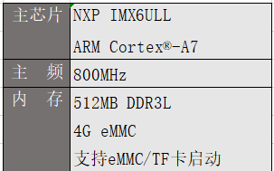
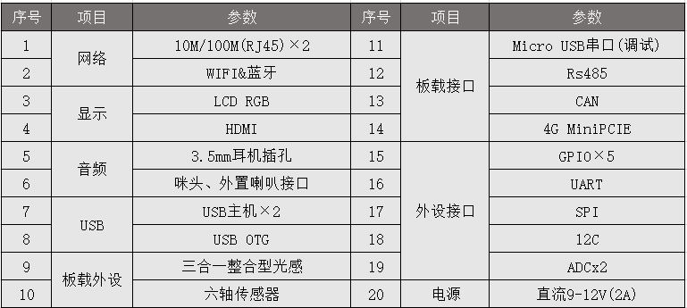
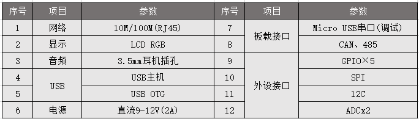
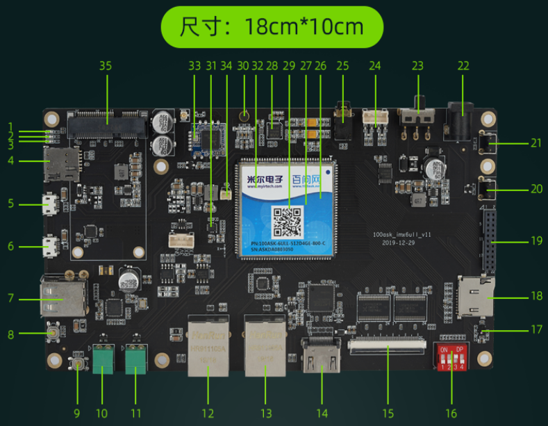
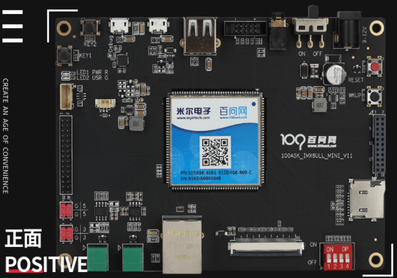
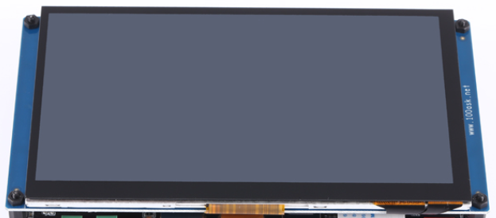

# 开发板名称：
# 100ASK_IMX6ULL开发套件


#### 开发板描述：
100ASK_IMX6ULL开发套件是深圳百问网科技有限公司于2020年9月推出的OpenHarmony系列开发板之一，支持OpenHarmony 1.0开源版本。

它分为Pro、Mini两个版本，前者有更多的模块，后者成本更低。

 

##### 关键词: 
工业控制，车载设备，智能家居，I.MX6ULL，Liteos-a内核移植的完整教程。


## 开发板介绍

### 开发板概述

100ASK_IMX6ULL开发套件基于NXP I.MX6ULL芯片设计，支持OpenHarmony，包含主板、配有触摸显示屏。

100ASK_IMX6ULL开发套件技术参数如下：

* 核心板



* Pro版本的底板

  


* Mini版本的底板

  


### 开发板功能

100ASK_IMX6ULL开发套件在工业控制领域、车载领域应用广泛。


## 开发板详情

一、主板

* Pro主板正面




* Mini主板正面

  


二、带触摸的LCD




## 应用案例场景

### 开发板应用场景

100ASK_IMX6ULL开发套件适用于工业控制、车载系统、消费电子。


### 上手指南

先使用一下命令下载文档、源码，里面有详细的文档：

```shell
git clone https://e.coding.net/weidongshan/openharmony/doc_and_source_for_openharmony.git
```

下文内容来自GIT仓库。


#### 环境搭建

> 在Ubuntu上，使用我们的一键配置环境脚本在ubuntu-18.04系统上一键配置鸿蒙系统运行环境

```
book@100ask:~$  wget --no-check-certificate -O Configuring_ubuntu.sh https://weidongshan.coding.net/p/DevelopmentEnvConf/d/DevelopmentEnvConf/git/raw/master/Configuring_ubuntu.sh && sudo chmod +x Configuring_ubuntu.sh && sudo ./Configuring_ubuntu.sh
```

#### 编译鸿蒙系统

##### 配置repo工具

> 首先需要设置GIT用户名和密码

```
book@100ask:~$ git config --global user.name "100ask"
book@100ask:~$ git config --global user.email "weidongshan@qq.com"
book@100ask:~$ git config --global credential.helper store
```

> 获取并安装repo工具

```
book@100ask:~$ curl https://gitee.com/oschina/repo/raw/fork_flow/repo-py3 > repo
book@100ask:~$ sudo cp repo  /usr/local/bin/repo && sudo chmod a+x /usr/local/bin/repo
book@100ask:~$ sudo pip3 install -i https://pypi.tuna.tsinghua.edu.cn/simple requests
```

##### 同步源码

```
book@100ask:~$ cd /home/book
book@100ask:~$ mkdir  openharmony && cd  openharmony
book@100ask:~$ repo init -u https://gitee.com/openharmony/manifest.git -b OpenHarmony-1.0
book@100ask:~$ repo sync -c -j8

```

##### 打补丁
> 获取补丁文件

```
book@100ask:~$ cd  /home/book
book@100ask:~$ git  clone  https://e.coding.net/weidongshan/openharmony/doc_and_source_for_openharmony.git
```

补丁文件`openharmony_100ask_v1.2.patch`位于如下目录，这两个目录里的文件是一样的：

```
doc_and_source_for_openharmony\IMX6ULL\source\01_文档配套的源码\patch\
    openharmony_100ask_v1.2.patch
doc_and_source_for_openharmony\STM32MP157\source\01_文档配套的源码\A7\patch\
    openharmony_100ask_v1.2.patch
```

> 给鸿蒙系统打补丁

```
// 为方便使用，先把补丁文件复制到/home/book目录
// 然后如下打补丁
book@100ask:~$ cd  /home/book/openharmony
book@100ask:~$ patch -p1 < /home/book/openharmony_100ask_v1.2.patch
```

#### 为IMX6ULL编译

```
book@100ask:~$ cd  /home/book/openharmony/kernel/liteos_a
book@100ask:~$ cp  tools/build/config/debug/imx6ull_clang.config .config   // 配置
book@100ask:~$ make clean      // 前面为hi3518ev300编译过，先清除一下
book@100ask:~$ make  -j  8     // 编译内核，可以得到out/imx6ull/liteos.bin
book@100ask:~$ make  rootfs    // 编译根文件系统，可以得到rootfs.img
book@100ask:~$ cp  out/imx6ull/rootfs.img out/imx6ull/rootfs.jffs2 // 改个名易辨认，烧写工具使用rootfs.jffs2
```


#### 烧写运行鸿蒙系统

使用百问网独家烧写工具点击鸿蒙按钮进行烧写，请参考：

```c
doc_and_source_for_openharmony\IMX6ULL\基于IMX6ULL的鸿蒙开发手册.docx
```

